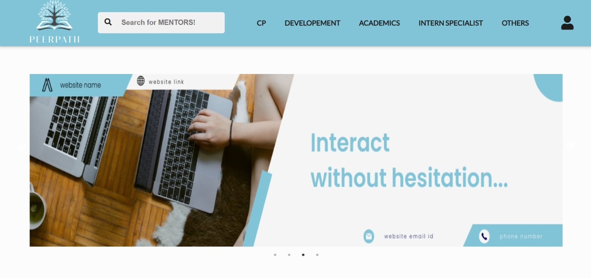
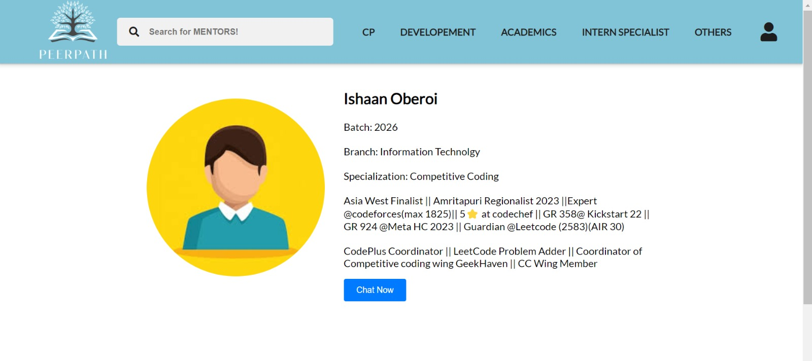

# PeerPath

## Overview
PeerPath is a mentorship platform designed to provide support and guidance to first-year college students. It connects juniors with senior students who mentor them on academics, campus life, and personal growth. The platform fosters a community-driven system, promoting knowledge sharing and easing the transition into college life.

## Features
- Mentorship system connecting senior and junior students
- Guidance on academics, campus life, and personal growth
- Community-driven support system
- Scalable architecture to accommodate a growing student base

## Tools & Technologies Used
- **Frontend**: HTML, CSS, JavaScript
- **Backend**: Node.js, Express.js
- **Database**: MongoDB

## Screenshots
### Home Page


### Profile Page




## Installation & Setup

### Prerequisites
Ensure you have the following installed on your system:
- Node.js and npm
- MongoDB (running locally or a cloud instance)

### Steps to Run the Project

1. **Clone the Repository**
   ```bash
   git clone https://github.com/yourusername/PeerPath.git
   cd PeerPath
   ```

2. **Backend Setup**
   ```bash
   cd backend
   npm install
   npm run start
   ```

3. **Frontend Setup**
   ```bash
   cd frontend
   npm install
   npm run start
   ```

4. **Access the Application**
   - The frontend will run at `http://localhost:3000`
   - The backend will be available at `http://localhost:5000` (or configured port)

## Contribution
Contributions are welcome! If you'd like to improve the project, follow these steps:
1. Fork the repository.
2. Create a new branch (`git checkout -b feature-branch`).
3. Commit your changes (`git commit -m "Add new feature"`).
4. Push to the branch (`git push origin feature-branch`).
5. Open a Pull Request.


## Contact
For any queries or suggestions, feel free to open an issue or contact the maintainers.


